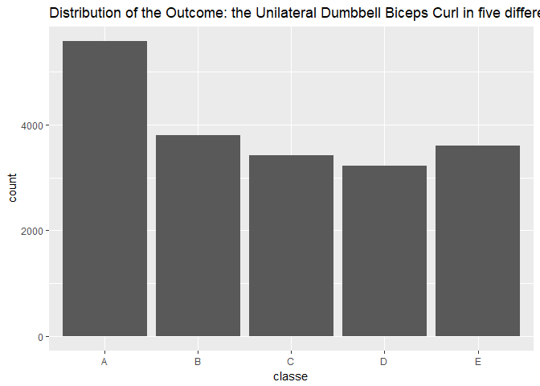

```r
library(dplyr)
library(ggplot2)
library(caret)
```


```
## [1] 16194
```


## Introduction

This project uses *Weight Lifting Exercises Dataset* to develop and test a human activity recognition/prediction model. In particular, the goal of this project is to recognise/predict the manner in which the wearers of a set of body sensors did the weight lifting exercise. It will process the data from accelerometers on the belt, forearm, arm, and dumbell of 6 participants who performed barbell lifts correctly and incorrectly in 5 different ways.

According to the [documentation](http://groupware.les.inf.puc-rio.br/har#dataset), six young health participants were asked to perform one set of 10 repetitions of the Unilateral Dumbbell Biceps Curl in five different fashions:

* exactly according to the specification (Class A),
* throwing the elbows to the front (Class B),
* lifting the dumbbell only halfway (Class C),
* lowering the dumbbell only halfway (Class D) and 
* throwing the hips to the front (Class E).

The final objective of the project is to corectly predict 20 different test cases. 

## Data Cleaning/Preprocessing
The data provided for project consists of two sets - a __*training*__ set and __*testing*__ set. The __*training*__ dataset will be used for choosing a learning model and a prediction using the chosen model will be done for the 20 cases in the __*testing*__ dataset. 

Reading the data in:

```r
training <- read.csv("Data/pml-training.csv", na.strings = c("NA", "", "#DIV/0!"))
testing <- read.csv("Data/pml-testing.csv", na.strings = c("NA", "", "#DIV/0!"))
```
The datasets contain a large numbers of missing values for many variables, whcih are coded as "NA", "", or "#DIV/0!". Therefore, the first step in the clening process was correctly labeling all the missing data points using the `read.csv()` function.

Next, such variables as `X`, `user_name`, `raw_timestamp_part_1`, `raw_timestamp_part_2`, `cvtd_timestamp`, `new_window`, `num_window` contain no data that have value for recognition/prediction purpose, so these varibles are deleted from the dataset. Also, data many variables in the following list contain 19216 to 19622 NA values (almost entirely missing!), so the variables will also be removed:

```r
sapply(X=training, FUN = function(d){sum(is.na(d))}) %>% sort(decreasing = T)
```

```
##        kurtosis_yaw_belt        skewness_yaw_belt    kurtosis_yaw_dumbbell 
##                    19622                    19622                    19622 
##    skewness_yaw_dumbbell     kurtosis_yaw_forearm     skewness_yaw_forearm 
##                    19622                    19622                    19622 
##   kurtosis_picth_forearm   skewness_pitch_forearm    kurtosis_roll_forearm 
##                    19301                    19301                    19300 
##          max_yaw_forearm          min_yaw_forearm    amplitude_yaw_forearm 
##                    19300                    19300                    19300 
##    skewness_roll_forearm       kurtosis_picth_arm       skewness_pitch_arm 
##                    19299                    19296                    19296 
##        kurtosis_roll_arm        skewness_roll_arm      kurtosis_picth_belt 
##                    19294                    19293                    19248 
##     skewness_roll_belt.1         kurtosis_yaw_arm         skewness_yaw_arm 
##                    19248                    19227                    19227 
##       kurtosis_roll_belt             max_yaw_belt             min_yaw_belt 
##                    19226                    19226                    19226 
##       amplitude_yaw_belt       skewness_roll_belt   kurtosis_roll_dumbbell 
##                    19226                    19225                    19221 
##         max_yaw_dumbbell         min_yaw_dumbbell   amplitude_yaw_dumbbell 
##                    19221                    19221                    19221 
##   skewness_roll_dumbbell  kurtosis_picth_dumbbell  skewness_pitch_dumbbell 
##                    19220                    19218                    19217 
##            max_roll_belt           max_picth_belt            min_roll_belt 
##                    19216                    19216                    19216 
##           min_pitch_belt      amplitude_roll_belt     amplitude_pitch_belt 
##                    19216                    19216                    19216 
##     var_total_accel_belt            avg_roll_belt         stddev_roll_belt 
##                    19216                    19216                    19216 
##            var_roll_belt           avg_pitch_belt        stddev_pitch_belt 
##                    19216                    19216                    19216 
##           var_pitch_belt             avg_yaw_belt          stddev_yaw_belt 
##                    19216                    19216                    19216 
##             var_yaw_belt            var_accel_arm             avg_roll_arm 
##                    19216                    19216                    19216 
##          stddev_roll_arm             var_roll_arm            avg_pitch_arm 
##                    19216                    19216                    19216 
##         stddev_pitch_arm            var_pitch_arm              avg_yaw_arm 
##                    19216                    19216                    19216 
##           stddev_yaw_arm              var_yaw_arm             max_roll_arm 
##                    19216                    19216                    19216 
##            max_picth_arm              max_yaw_arm             min_roll_arm 
##                    19216                    19216                    19216 
##            min_pitch_arm              min_yaw_arm       amplitude_roll_arm 
##                    19216                    19216                    19216 
##      amplitude_pitch_arm        amplitude_yaw_arm        max_roll_dumbbell 
##                    19216                    19216                    19216 
##       max_picth_dumbbell        min_roll_dumbbell       min_pitch_dumbbell 
##                    19216                    19216                    19216 
##  amplitude_roll_dumbbell amplitude_pitch_dumbbell       var_accel_dumbbell 
##                    19216                    19216                    19216 
##        avg_roll_dumbbell     stddev_roll_dumbbell        var_roll_dumbbell 
##                    19216                    19216                    19216 
##       avg_pitch_dumbbell    stddev_pitch_dumbbell       var_pitch_dumbbell 
##                    19216                    19216                    19216 
##         avg_yaw_dumbbell      stddev_yaw_dumbbell         var_yaw_dumbbell 
##                    19216                    19216                    19216 
##         max_roll_forearm        max_picth_forearm         min_roll_forearm 
##                    19216                    19216                    19216 
##        min_pitch_forearm   amplitude_roll_forearm  amplitude_pitch_forearm 
##                    19216                    19216                    19216 
##        var_accel_forearm         avg_roll_forearm      stddev_roll_forearm 
##                    19216                    19216                    19216 
##         var_roll_forearm        avg_pitch_forearm     stddev_pitch_forearm 
##                    19216                    19216                    19216 
##        var_pitch_forearm          avg_yaw_forearm       stddev_yaw_forearm 
##                    19216                    19216                    19216 
##          var_yaw_forearm                        X                user_name 
##                    19216                        0                        0 
##     raw_timestamp_part_1     raw_timestamp_part_2           cvtd_timestamp 
##                        0                        0                        0 
##               new_window               num_window                roll_belt 
##                        0                        0                        0 
##               pitch_belt                 yaw_belt         total_accel_belt 
##                        0                        0                        0 
##             gyros_belt_x             gyros_belt_y             gyros_belt_z 
##                        0                        0                        0 
##             accel_belt_x             accel_belt_y             accel_belt_z 
##                        0                        0                        0 
##            magnet_belt_x            magnet_belt_y            magnet_belt_z 
##                        0                        0                        0 
##                 roll_arm                pitch_arm                  yaw_arm 
##                        0                        0                        0 
##          total_accel_arm              gyros_arm_x              gyros_arm_y 
##                        0                        0                        0 
##              gyros_arm_z              accel_arm_x              accel_arm_y 
##                        0                        0                        0 
##              accel_arm_z             magnet_arm_x             magnet_arm_y 
##                        0                        0                        0 
##             magnet_arm_z            roll_dumbbell           pitch_dumbbell 
##                        0                        0                        0 
##             yaw_dumbbell     total_accel_dumbbell         gyros_dumbbell_x 
##                        0                        0                        0 
##         gyros_dumbbell_y         gyros_dumbbell_z         accel_dumbbell_x 
##                        0                        0                        0 
##         accel_dumbbell_y         accel_dumbbell_z        magnet_dumbbell_x 
##                        0                        0                        0 
##        magnet_dumbbell_y        magnet_dumbbell_z             roll_forearm 
##                        0                        0                        0 
##            pitch_forearm              yaw_forearm      total_accel_forearm 
##                        0                        0                        0 
##          gyros_forearm_x          gyros_forearm_y          gyros_forearm_z 
##                        0                        0                        0 
##          accel_forearm_x          accel_forearm_y          accel_forearm_z 
##                        0                        0                        0 
##         magnet_forearm_x         magnet_forearm_y         magnet_forearm_z 
##                        0                        0                        0 
##                   classe 
##                        0
```

Cleaning both datasets:

```r
data_clean <- function(dat){
    
    dat <- subset(dat, select = -c(X, 
                                   user_name,
                                   raw_timestamp_part_1,
                                   raw_timestamp_part_2,
                                   cvtd_timestamp,
                                   new_window,
                                   num_window))  
    dat <- dat[,sapply(X=dat, FUN = function(d){sum(is.na(d))}) == 0]
    return(dat)
}


training <- data_clean(training)
testing <- data_clean(testing)
```

## Data Slicing
To effectively choose a learning model for the task, it is necessary to be able to estimate the model's accuracy based on its out-of-sample error rate. Therefore, it is important to split the original __*training*__ dataset into *training* and *testing* subsets and use the *training* subset for learning and *testing* subset for estimating the lerner's accuracy. 

The following splits the available __*training*__ data into two subsets so that 75% of the cases become part of the *train* subset and 25% become part of the *test* subset:

```r
indexTrain <- createDataPartition(y = training$classe, p=0.75, list = FALSE)
train <- training[indexTrain,]
test <- training[-indexTrain,]
```


## Predicting
The following is the distribution of the outcome variable, which is at a 5-level nominal scale and does not appear to have any extreme abnormalities to additionally address: 

```r
training %>% ggplot(aes(x=classe)) + geom_bar() + labs(title = "Distribution of the Outcome: the Unilateral Dumbbell Biceps Curl in five different fashions")
```



The rest of the variables are either numeric or integer:

```r
sapply(train, class) %>% sort() 
```

```
##               classe     total_accel_belt         accel_belt_x 
##             "factor"            "integer"            "integer" 
##         accel_belt_y         accel_belt_z        magnet_belt_x 
##            "integer"            "integer"            "integer" 
##        magnet_belt_y        magnet_belt_z      total_accel_arm 
##            "integer"            "integer"            "integer" 
##          accel_arm_x          accel_arm_y          accel_arm_z 
##            "integer"            "integer"            "integer" 
##         magnet_arm_x         magnet_arm_y         magnet_arm_z 
##            "integer"            "integer"            "integer" 
## total_accel_dumbbell     accel_dumbbell_x     accel_dumbbell_y 
##            "integer"            "integer"            "integer" 
##     accel_dumbbell_z    magnet_dumbbell_x    magnet_dumbbell_y 
##            "integer"            "integer"            "integer" 
##  total_accel_forearm      accel_forearm_x      accel_forearm_y 
##            "integer"            "integer"            "integer" 
##      accel_forearm_z     magnet_forearm_x            roll_belt 
##            "integer"            "integer"            "numeric" 
##           pitch_belt             yaw_belt         gyros_belt_x 
##            "numeric"            "numeric"            "numeric" 
##         gyros_belt_y         gyros_belt_z             roll_arm 
##            "numeric"            "numeric"            "numeric" 
##            pitch_arm              yaw_arm          gyros_arm_x 
##            "numeric"            "numeric"            "numeric" 
##          gyros_arm_y          gyros_arm_z        roll_dumbbell 
##            "numeric"            "numeric"            "numeric" 
##       pitch_dumbbell         yaw_dumbbell     gyros_dumbbell_x 
##            "numeric"            "numeric"            "numeric" 
##     gyros_dumbbell_y     gyros_dumbbell_z    magnet_dumbbell_z 
##            "numeric"            "numeric"            "numeric" 
##         roll_forearm        pitch_forearm          yaw_forearm 
##            "numeric"            "numeric"            "numeric" 
##      gyros_forearm_x      gyros_forearm_y      gyros_forearm_z 
##            "numeric"            "numeric"            "numeric" 
##     magnet_forearm_y     magnet_forearm_z 
##            "numeric"            "numeric"
```

For the nominal-level outcome, it is appropriate to classification rather than regression learners. Therefore, for the purposes of this project the following classification models will be considered:

* Classification Trees (CART model)
* Random Forest (rf) 
* Boosting (gbm)

The method based on classification trees is relatively simple and must be fast in classifying the training dataset with 14718 observations. At the same time, it might demonstrate low accuracy. On the other handthe latter two methods are among the most accurate existing learners but also require significant computational power. 

### Classification Trees | CART


```r
mFit_cart <- train(classe ~ ., method = "rpart", data = train)
print(mFit_cart)
```

```
## CART 
## 
## 14718 samples
##    52 predictor
##     5 classes: 'A', 'B', 'C', 'D', 'E' 
## 
## No pre-processing
## Resampling: Bootstrapped (25 reps) 
## Summary of sample sizes: 14718, 14718, 14718, 14718, 14718, 14718, ... 
## Resampling results across tuning parameters:
## 
##   cp          Accuracy   Kappa     
##   0.03560239  0.5166595  0.37539448
##   0.05879933  0.3789780  0.14835438
##   0.11288332  0.3278264  0.06761666
## 
## Accuracy was used to select the optimal model using the largest value.
## The final value used for the model was cp = 0.03560239.
```

```r
print(mFit_cart$finalModel)
```

```
## n= 14718 
## 
## node), split, n, loss, yval, (yprob)
##       * denotes terminal node
## 
##  1) root 14718 10533 A (0.28 0.19 0.17 0.16 0.18)  
##    2) roll_belt< 130.5 13509  9334 A (0.31 0.21 0.19 0.18 0.11)  
##      4) pitch_forearm< -33.95 1173     7 A (0.99 0.006 0 0 0) *
##      5) pitch_forearm>=-33.95 12336  9327 A (0.24 0.23 0.21 0.2 0.12)  
##       10) magnet_dumbbell_y< 439.5 10429  7486 A (0.28 0.18 0.24 0.19 0.11)  
##         20) roll_forearm< 121.5 6464  3840 A (0.41 0.18 0.18 0.17 0.06) *
##         21) roll_forearm>=121.5 3965  2674 C (0.08 0.18 0.33 0.23 0.19) *
##       11) magnet_dumbbell_y>=439.5 1907   955 B (0.035 0.5 0.046 0.22 0.2) *
##    3) roll_belt>=130.5 1209    10 E (0.0083 0 0 0 0.99) *
```

Out-of-sample accuracy:

```r
predicted_cart <- predict(mFit_cart, test)
accuracyRate <- function(predicted, values){ sum((predicted==values)*1)/sum(length(values)) }
accuracyRate(predicted_cart, test$classe)
```

```
## [1] 0.5063214
```
The accuracy of this model is just above 50%, which is too low to be acceptable. 


### Random Forest

```r
mFit_rf <- train(classe ~ ., method = "rf", data = train, trControl = trainControl(method="cv"), number=3)
mFit_rf
```

```
## Random Forest 
## 
## 14718 samples
##    52 predictor
##     5 classes: 'A', 'B', 'C', 'D', 'E' 
## 
## No pre-processing
## Resampling: Cross-Validated (10 fold) 
## Summary of sample sizes: 13246, 13245, 13247, 13244, 13248, 13247, ... 
## Resampling results across tuning parameters:
## 
##   mtry  Accuracy   Kappa    
##    2    0.9921858  0.9901144
##   27    0.9923218  0.9902868
##   52    0.9889929  0.9860753
## 
## Accuracy was used to select the optimal model using the largest value.
## The final value used for the model was mtry = 27.
```

Out-of-sample accuracy:

```r
predicted_rf <- predict(mFit_rf, test)              
accuracyRate(predicted_rf, test$classe)
```

```
## [1] 0.9963295
```

### Boosting

```r
mFit_boost <- train(classe ~ ., data = train, method = "gbm", verbose=FALSE)
mFit_boost
```

```
## Stochastic Gradient Boosting 
## 
## 14718 samples
##    52 predictor
##     5 classes: 'A', 'B', 'C', 'D', 'E' 
## 
## No pre-processing
## Resampling: Bootstrapped (25 reps) 
## Summary of sample sizes: 14718, 14718, 14718, 14718, 14718, 14718, ... 
## Resampling results across tuning parameters:
## 
##   interaction.depth  n.trees  Accuracy   Kappa    
##   1                   50      0.7485790  0.6814130
##   1                  100      0.8148563  0.7657212
##   1                  150      0.8482663  0.8080144
##   2                   50      0.8498907  0.8098666
##   2                  100      0.9024094  0.8765167
##   2                  150      0.9259354  0.9062960
##   3                   50      0.8935593  0.8652748
##   3                  100      0.9364065  0.9195479
##   3                  150      0.9557413  0.9440195
## 
## Tuning parameter 'shrinkage' was held constant at a value of 0.1
## 
## Tuning parameter 'n.minobsinnode' was held constant at a value of 10
## Accuracy was used to select the optimal model using the largest value.
## The final values used for the model were n.trees = 150,
##  interaction.depth = 3, shrinkage = 0.1 and n.minobsinnode = 10.
```

Out-of-sample accuracy:

```r
predicted_boost <- predict(mFit_boost, test)          
accuracyRate(predicted_boost, test$classe)
```

```
## [1] 0.9690049
```

## Prediction for the Project 20 Test Cases
Prediction for the 20 test cases using the Decision Tree model:

```r
predicted_cart_testing <- predict(mFit_cart, testing)
predicted_cart_testing
```

```
##  [1] C A C A A C C A A A C C C A C A A A A C
## Levels: A B C D E
```

Prediction for the 20 test cases using the Random Forest model:

```r
predicted_rf_testing <- predict(mFit_rf, testing)   #Prediction for 20-obs. quiz dataset 
predicted_rf_testing
```

```
##  [1] B A B A A E D B A A B C B A E E A B B B
## Levels: A B C D E
```

Prediction for the 20 test cases using the Boosting model:

```r
predicted_boost_testing <- predict(mFit_boost, testing)  #Prediction for 20-obs. quiz dataset 
predicted_boost_testing
```

```
##  [1] B A B A A E D B A A B C B A E E A B B B
## Levels: A B C D E
```

Finally, the following check the agreement accuracy between the Random Forest and Boosting methods:

```r
sum(predicted_rf_testing==predicted_boost_testing)
```

```
## [1] 20
```

As we can see, the last two methods - Boosting and Random Forest appear to be 96.9 and 99.6 percent accurate and agree with each other in their prediction of all of the 20 test cases.

